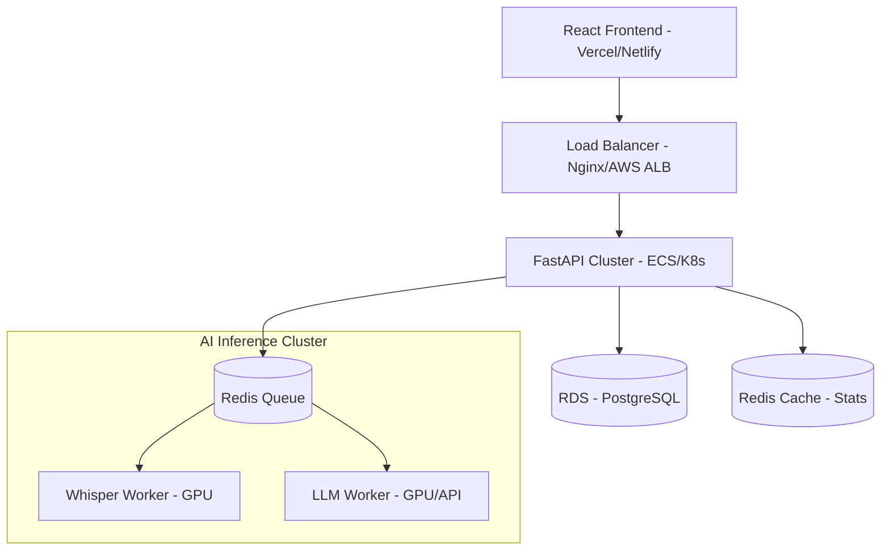

# AgentUp - Scalable System Design

This document outlines how the AgentUp platform can scale to handle thousands of concurrent call center agents and intensive AI workloads.

## Architecture Diagram

## Scalability Strategies

### 1. Decoupled AI Inference (Asynchronous Processing)
Transcription and LLM simulations are compute-intensive. Moving these out of the request-response cycle is critical:
- **Task Queues**: Use Celery/Redis to offload `Whisper` transcription.
- **WebSocket/Polling**: The frontend can poll or use WebSockets to receive the transcription result once ready.
- **Horizontal Scaling**: Add more Workers with dedicated GPUs (e.g., T4/A10) as demand increases.

### 2. Database Optimization
- **Read Replicas**: For dashboard analytics, use read replicas to offload the primary database.
- **Indexes**: Ensure indexes on `user_id` and `timestamp` for fast retrieval of session history.
- **Caching**: Use Redis to cache cumulative user stats (streaks, average scores) which only update at the end of a session.

### 3. Frontend Performance
- **CDN**: Serve static assets via CloudFront/Cloudflare.
- **Bundling**: Code-split pages (Daily Training vs. Dashboard) to reduce initial load time.

### 4. High Availability
- **Multi-AZ Deployment**: Deploy API and DB across multiple Availability Zones.
- **Auto-Scaling Groups**: Scale API instances based on CPU/Memory usage.

## AI Scaling Specifics
- **Model Quantization**: Use `ctranslate2` or `int8` quantization for Whisper to reduce VRAM usage and increase throughput.
- **Batching**: Implement request batching for LLM calls to improve GPU utilization.
- **API Fallbacks**: Use managed services (OpenAI/Anthropic) as a burstable fallback during high traffic surges.
